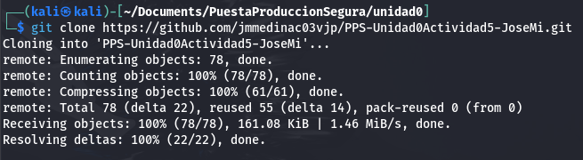
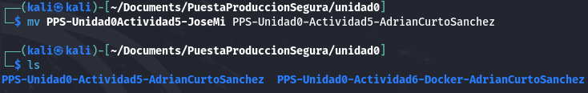
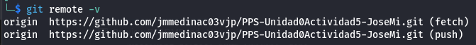
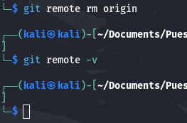
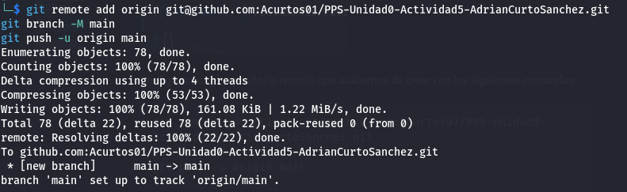
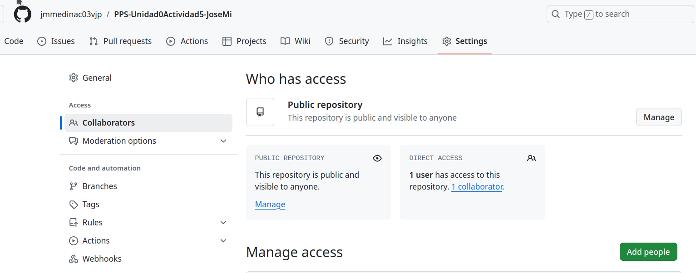
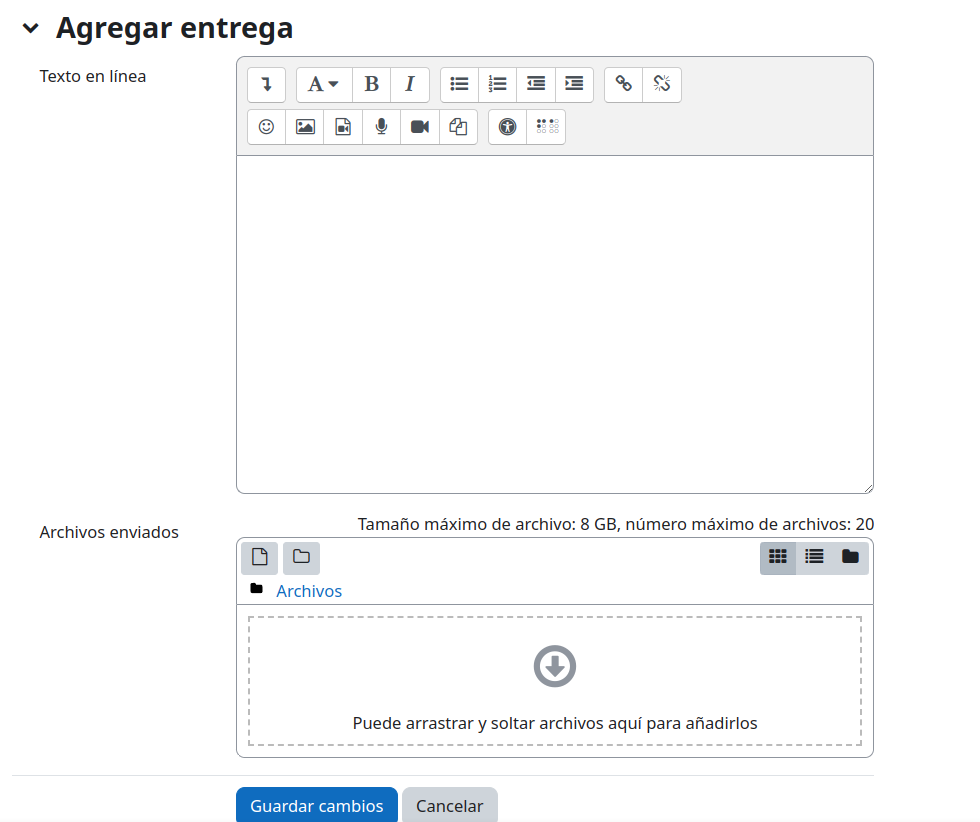

Actividad 5 - Unidad 0
Uso de Git (III)
===============


[Creación del repositorio](#Creación-del-repositorio)

[Viendo los remotos](#Viendo-los-remotos)

[Visualizando la página web](#Visualizando-la-página-web)

[Colaborando](#Colaborando)

[Git logs](#Erre-que-erre-con-Git-Logs)

[Entrega](#Entrega)

---

### Creación del repositorio

En esta ocasión vamos a crear nuestro proyecto a partir de otro proyecto ya existente.

Clonamos el repositorio en nuestro equipo con el comando `git clone git@github.com:Acurtos01/PPS-Unidad0-Actividad6-Docker-AdrianCurtoSanchez.git`.



Modificamos el nombre de la carpeta de nuestro proyecto con el comando `mv PPS-Unidad0Actividad5-JoseMi PPS-Unidad0-Actividad5-AdrianCurtoSanchez`.




### Configurando repositorio remoto

> Con `git remote -v` podemos ver los repositorios remotos que tenemos configurados.



> Con `git remote rm origin` podemos eliminar los repositorios remotos que tenemos configurados.



Configuramos el repositorio remoto que acabamos de crear con los siguientes comandos:

```
git remote add origin git@github.com:Acurtos01/PPS-Unidad0-Actividad5-AdrianCurtoSanchez.git
git branch -M main
git push -u origin main
``` 



Con el nuevo repositorio configurado podemos crear nuestro commit y realizar push de los cambio al repositorio remoto.

```
git commit -am "Creación del proyecto y cambio de repositorio"

git push
```


### Visualizando la página web

1. Visualiza con php el contenido de la página web( ``php -S 0:8080``).
2. Introduce dentro de la carpeta img una imagen de tu foto o avatar. El nombre del archivo debe de llevar como nombre tu nombre. 
3. Dentro de la carpeta profile crea un archivo html con el mismo nombre del archivo de la imagen que copiaste en el punto anterior.
4. Lanza el comando php para que se muestre el contenido de la página web y ver cómo se ha modificado.

### Colaborando

> Podemos añadir colaboradores en nuestro proyecto desde la ___Configuración___ del Repositorio, apartado ___Collaborators___. Éstos podrán realizar cambios en él. 



1. Comparte tu proyecto con al menos dos compañeros.
1. Para cada uno de los proyectos  de tus compañeros:
	1. Acepta la invitación de colaboración en su repositorio.
	1. Clona el repositorio (Recuerda que tendrás que crear una carpeta nueva para él).
	1. Añade una nueva rama con tu nombre(``git branch``).
	1. Cámbiate a la rama que has creado(``git checkout``).
	1. Comprueba en que rama te encuentras (``git`` status te dá la información).
	1. Mira los remotos que tienes configurados.
	1. Añade en esa rama tus archivos de usuario (foto y profile).
	1. Sube los cambios de tu rama al repositorio remoto y comprueba que puedes verlos en la web.

> Ahora vamos a hacer modificaciones en la rama main de tus compañeros. Es importante que el tiempo entre el push y el pull sea pequeño, ya que si en ese tiempo hay modificaciones por parte de otro colaborador, es posible que haya inconsistencias, en cuyo caso tendremos que utilizar ``git merge``.

1. Cambiate a la rama main de los proyectos de tus compañeros
1. Sincroniza en __local__ la rama __main__. (puedes comprobar qué compañeros han subido datos lanzando la aplicación web con php).
1. Añade en ella tus archivos de usuario (foto y profile).
1. Sube los cambios a la rama main de los repositorios de tus compañeros.
1. Vuelve a tu repositorio.
1. Comprueba en qué rama te encuentras.
1. Comprueba que tus compañeros hayan creado sus ramas en tu repositorio (``git branch``). Si no es así...!!!! échales una mano, hombre¡¡¡¡¡
1. Comprueba con ``git diff`` las diferencias existentes entre las ramas Main y las de tus compañeros

### Erre que erre con Git Logs

>Repasemos git logs

1. Muestra los logs
2. Muestra los logs de los últimos 3 commits
1. Muestra los logs utilizando el modificador ``--pretty``
1. Muestra los logs de los últimos 2 commits donde se vean las diferencias de cada una de las entradas.
1. Muestra los logs de las modificaciones realizadas en el último día


### Entrega

> Intenta coordinarte con tus compañeros y, a ser posible, realiza la entrega una vez que ellos hayan hecho las modificaciones oportunas en tu repositorio.
> Una vez documentado todo el proceso en tu README.md, en la entrega por la plataforma tendrás que entregar por duplicado:
> + En la sección de ___Texto en línea___, pega el __enlace__ a tu repositorio de github.com
> + En la sección de ___Archivos adjuntos___, envía __comprimida la carpeta local de tu repositorio__.



